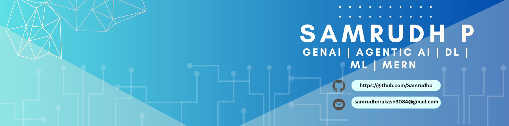

## 👋 Hey there, I'm Samrudh!  

- Passionate about **Generative AI, RAG (Retrieval-Augmented Generation), Agentic AI and AI/ML systems**  
- Exploring **deep learning, transformers, and multimodal AI**  
- Building **real-world GenAI projects** 
- Expanding into **Azure & DevOps** to scale AI solutions  
- Mastered **MERN stack**  
- Open to collaboration on **AI research, GenAI tooling, and cloud-native projects** 

---

## 📊 GitHub Analytics

### 📈 Performance Metrics

<table>
  <tr>
    <td>
      
    </td>
    <td>
      
    </td>
  </tr>
</table>

### 📉 Contribution Graph

### 🎯 Profile Stats

  
  
  

---

## 💻 Tech Stack

### 🤖 AI & Machine Learning

### 🌐 Web Development

### 💾 Databases & Vector Stores

### ☁️ Cloud & DevOps

### 📝 Programming Languages

---

## LeetCode Stats

---

## 🤝 Let's Connect!

### 💬 Open to collaborations in AI/ML, GenAI, and Full-Stack Development!

---